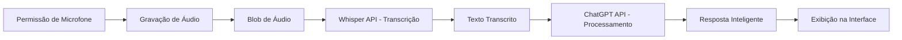

# 🎙️ DataCrazy Voice Assistant - Desafio Front-end

> Aplicação web de mensageria com transcrição de áudio em tempo real usando OpenAI Whisper e respostas inteligentes com ChatGPT.

[](https://reactjs.org/)
[](https://openai.com/)
[](https://opensource.org/licenses/MIT)

## 🎯 Objetivo do Projeto

Solução técnica para o **Desafio n.º 1 :: Front-end de mensageria**, desenvolvendo uma aplicação React que:

- ✅ Solicita e gerencia permissão de áudio do navegador
- ✅ Captura áudio do usuário em tempo real
- ✅ Envia áudio para API de transcrição da OpenAI (Whisper)
- ✅ Processa transcrição com API de completions (ChatGPT)
- ✅ Exibe fluxo completo de voz → texto → resposta IA

## 🏗️ Arquitetura do Projeto

### **Estrutura de Pastas**

```text
datacrazy-frontend/
├── src/
│   ├── components/
│   │   ├── AudioRecorder/
│   │   │   ├── AudioRecorder.jsx
│   │   │   └── AudioRecorder.css
│   │   ├── TranscriptionDisplay/
│   │   │   ├── TranscriptionDisplay.jsx
│   │   │   └── TranscriptionDisplay.css
│   │   ├── ChatResponse/
│   │   │   ├── ChatResponse.jsx
│   │   │   └── ChatResponse.css
│   │   └── StatusIndicator/
│   │       ├── StatusIndicator.jsx
│   │       └── StatusIndicator.css
│   ├── hooks/
│   │   └── useAudioRecorder.js
│   ├── services/
│   │   └── openaiService.js
│   ├── utils/
│   │   └── audioHelpers.js
│   ├── App.jsx
│   └── App.css
├── public/
└── package.json
```

### **Fluxo da Aplicação**



## 🛠️ Tecnologias Utilizadas

- **React 18.2.0** - Biblioteca principal para construção da UI
- **OpenAI APIs**:
  - **Whisper API** - Transcrição de áudio para texto
  - **GPT-3.5 Turbo** - Geração de respostas contextuais
- **Web Audio API** - Captura e manipulação de áudio do navegador
- **Axios** - Cliente HTTP para chamadas de API
- **CSS Modules** - Estilização componentizada
- **Vercel** - Plataforma de deploy e hosting

## ⚡ Funcionalidades Principais

### 1. Sistema Inteligente de Permissão de Áudio
- Solicitação contextual de acesso ao microfone
- Gerenciamento de estado de permissão (local/global)
- Feedback visual claro sobre status do microfone
- Recuperação de erros e fallbacks

### 2. Gravação em Tempo Real
- Interface visual com indicador de gravação ativa
- Contador de tempo de gravação
- Prévia de áudio com player embutido
- Validação de qualidade do áudio (durações mínimas)

### 3. Pipeline de Processamento com IA
- Conversão áudio → texto com Whisper API
- Processamento assíncrono com estados de loading
- Integração com GPT-3.5 para respostas contextuais
- Tratamento robusto de erros de API

### 4. Interface de Usuário Profissional
- Design responsivo e moderno
- Indicador visual de fluxo (3 passos)
- Feedback em tempo real de cada etapa
- Botões de ação claros e intuitivos

## 🔧 Instalação e Configuração

### Pré-requisitos
- Node.js 16+
- Chave de API da OpenAI
- Navegador moderno com suporte a Web Audio API

### Passos para Executar Localmente

```bash
# 1. Clone o repositório
git clone https://github.com/patrick-git-bite/DataCrazy-challanger-frontend.git
cd DataCrazy-challanger-frontend

# 2. Instale as dependências
npm install

# 3. Configure as variáveis de ambiente
# Crie um arquivo .env na raiz:
echo "REACT_APP_OPENAI_API_KEY=sua_chave_aqui" > .env

# 4. Inicie a aplicação
npm start
```
A aplicação estará disponível em `http://localhost:3000`

### Configuração da OpenAI API
1. Acesse [platform.openai.com](https://platform.openai.com)
2. Crie uma conta ou faça login
3. Gere uma nova API Key em "API Keys"
4. Copie a chave e adicione ao arquivo `.env`

## 📁 Estrutura de Componentes

### `AudioRecorder.jsx` (Componente Principal)
```javascript
// Arquitetura baseada em hooks customizados
const AudioRecorder = ({ onAudioRecorded, hasGlobalPermission }) => {
  const {
    isRecording,
    audioBlob,
    permissionGranted,
    recordingTime,
    requestPermission,
    startRecording,
    stopRecording,
  } = useAudioRecorder();
  
  // Lógica de renderização condicional
  // Gerenciamento de estado de permissão
  // Controle do fluxo de gravação
};
```

### `useAudioRecorder.js` (Hook Customizado)
- Encapsula toda a lógica de gravação de áudio
- Gerencia MediaRecorder API do navegador
- Controla estados de permissão e gravação
- Fornece timer de gravação em tempo real

### `openaiService.js` (Camada de Serviço)
```javascript
// Serviço modular para comunicação com OpenAI
export const transcribeAudio = async (audioBlob) => {
  // Converte Blob para FormData
  // Envia para endpoint /v1/audio/transcriptions
  // Retorna texto transcrito
};

export const getChatCompletion = async (transcription) => {
  // Envia texto para /v1/chat/completions
  // Configura system prompt para contexto
  // Retorna resposta do assistente
};
```

## 🧪 Decisões Técnicas e Desafios

### 1. Gestão de Permissão de Áudio
**Desafio:** Solicitar permissão apenas quando necessário, sem bloquear a UX.
**Solução:** Implementação de dois níveis de permissão:
- `hasGlobalPermission`: Estado do App (para controle de fluxo)
- `localPermission`: Estado interno do AudioRecorder (para ações imediatas)

### 2. Streaming vs Blob Processing
**Desafio:** Whisper API requer arquivo completo, não streaming.
**Solução:**
- Uso de MediaRecorder para capturar áudio em chunks
- Conversão para Blob único ao final da gravação
- Validação de tamanho mínimo (1000 bytes)

### 3. Estado Assíncrono e Feedback Visual
**Desafio:** Manter UI responsiva durante chamadas de API (1-5 segundos).
**Solução:**
- Componente `StatusIndicator` com 3 estágios visuais
- Overlay de loading durante processamento
- Estados de erro com mensagens amigáveis

### 4. Segurança de Chaves de API
**Desafio:** Não expor chaves da OpenAI no frontend.
**Solução:**
- Variáveis de ambiente com prefixo `REACT_APP_`
- Configuração obrigatória no Vercel para deploy
- Validação no lado do cliente antes de chamadas

## 🔍 Como o Código Funciona (Explicação Técnica)

### Fluxo Completo:
1. **Inicialização:** App carrega com `currentStep = 1` (gravação)
2. **Permissão:** Usuário clica "Permitir Microfone" → `navigator.mediaDevices.getUserMedia()`
3. **Gravação:** Clique "Iniciar Gravação" → `MediaRecorder.start()`
4. **Captura:** Áudio convertido para Blob via `ondataavailable`
5. **Transcrição:** Blob enviado para Whisper API como `multipart/form-data`
6. **Processamento:** Texto transcrito enviado para ChatGPT com prompt contextual
7. **Exibição:** Resposta renderizada em componentes estilizados

### Tratamento de Erros:
```javascript
try {
  const transcribedText = await transcribeAudio(audioBlob);
  setTranscription(transcribedText);
  // Continua para ChatGPT...
} catch (error) {
  console.error('Erro:', error);
  // Exibe mensagem amigável
  // Permite retentativa
} finally {
  setLoading(false);
}
```

## 📈 Próximas Melhorias (Roadmap)
- [ ] Implementar streaming de áudio para resposta da IA
- [ ] Adicionar suporte a múltiplos idiomas
- [ ] Criar histórico de conversações
- [ ] Adicionar exportação de transcrições (PDF/TXT)
- [ ] Implementar modo offline com Web Speech API
- [ ] Adicionar análise de sentimento do áudio

## 🤝 Contribuindo
1. Fork o projeto
2. Crie uma branch (`git checkout -b feature/nova-funcionalidade`)
3. Commit suas mudanças (`git commit -m 'Add nova funcionalidade'`)
4. Push para a branch (`git push origin feature/nova-funcionalidade`)
5. Abra um Pull Request

## 📄 Licença
Este projeto está licenciado sob a licença MIT - veja o arquivo [LICENSE](LICENSE) para detalhes.

## 👨‍💻 Autor
**Patrick Brando** - [GitHub](https://github.com/patrick-git-bite)

## 🙏 Agradecimentos
- Equipe DataCrazy pelo desafio técnico
- OpenAI pelas APIs de ponta
- Comunidade React pela documentação excelente

---
Este projeto foi desenvolvido como solução para o desafio técnico de front-end da DataCrazy, demonstrando habilidades em React, integração com APIs de IA, e desenvolvimento de interfaces complexas com processamento de mídia em tempo real.